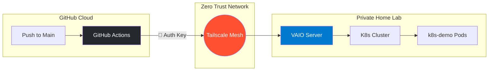

# 🚀 K8s Demo Application

A modern React + TypeScript application built with Vite, designed to demonstrate automated CI/CD pipelines to a private home lab via Tailscale.

## 🏗️ Architecture & Deployment Flow

This project uses a secure, zero-trust deployment pipeline to push updates from the public internet to a private home server (VAIO).



### Deployment Breakdown:
1.  **🐙 GitHub Actions**: Triggered on every push to the `main` branch.
2.  **🔑 Tailscale**: The runner authenticates using a Tailscale Auth Key, joining your private mesh network securely.
3.  **💻 VAIO Server**: The runner communicates directly with your VAIO server's internal IP through the encrypted tunnel.
4.  **☸️ Kubernetes**: Manifests are applied directly to the cluster, updating the `k8s-demo` service.

---

## 🛠️ Tech Stack

- **Frontend**: [React 19](https://react.dev/)
- **Build Tool**: [Vite](https://vitejs.dev/)
- **Type Safety**: [TypeScript](https://www.typescriptlang.org/)
- **Containerization**: [Docker](https://www.docker.com/)
- **Orchestration**: [Kubernetes](https://kubernetes.io/)

---

## 🚀 Getting Started

### Local Development
```bash
# Install dependencies
npm install

# Start development server
npm run dev
```

### Production Build
```bash
# Build the application
npm run build

# Preview production build
npm run preview
```

---

## 📦 Kubernetes Configuration

The deployment manifests are located in the `k8s/` directory:
- `deploy.yaml`: Defines the `Deployment` (2 replicas) and the `LoadBalancer` service on port `3000`.

To apply manually:
```bash
kubectl apply -f k8s/deploy.yaml
```

---

## 🛡️ CI/CD Configuration

The automation is defined in `.github/workflows/deploy.yml`. 

**Required Secrets:**
- `TAILSCALE_AUTHKEY`: Used to join the private network.
- `DOCKER_PASSWORD`: (Optional) If pushing to a registry.

---

## License
MIT
